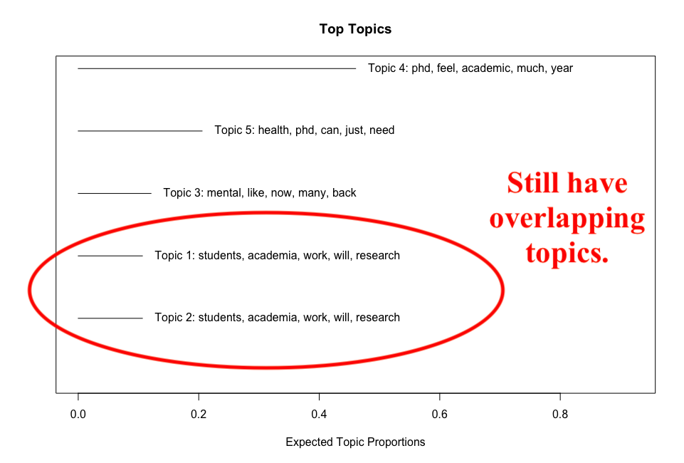
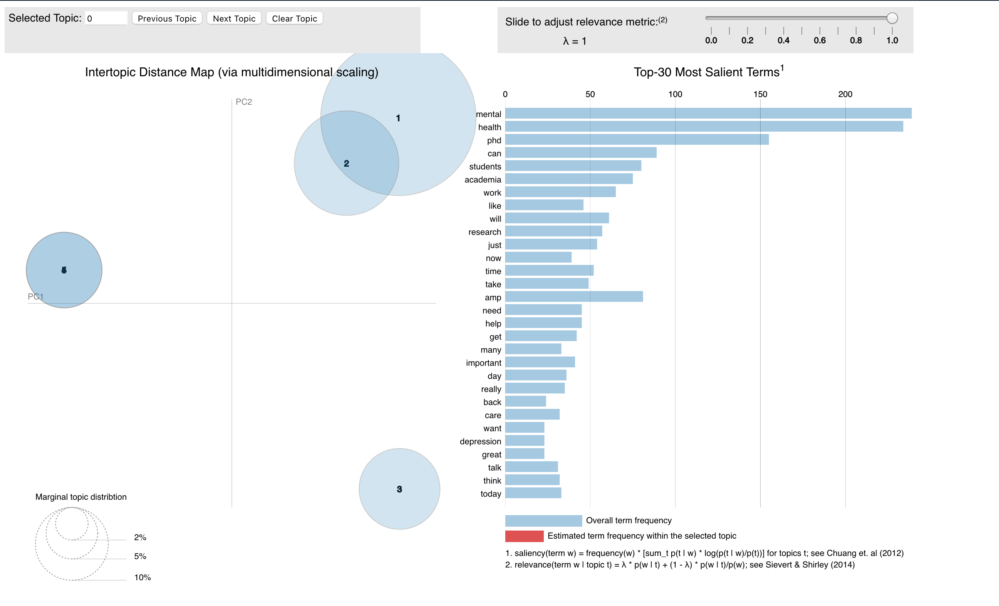

class: title-slide, inverse, center, top, middle

```{r setup, include=FALSE}
knitr::opts_chunk$set(echo = FALSE)
```

```{r, echo=FALSE}
# then load all the relevant packages
pacman::p_load(pacman, tidyverse, tidytext, wordcloud2, readxl, 
               forcats, remotes, ggplot2, rtweet, htmlwidgets, 
               vader, webshot, ggcats, Hmisc, kableExtra, topicmodels, 
               stm, LDAvis, SnowballC, ldatuning, knitr)
```

```{r xaringan-panelset, echo=FALSE}
xaringanExtra::use_panelset()
```

```{r xaringanExtra-clipboard, echo=FALSE}
htmltools::tagList(
  xaringanExtra::use_clipboard(
    button_text = "<i class=\"fa fa-clipboard\"></i>",
    success_text = "<i class=\"fa fa-check\" style=\"color: #90BE6D\"></i>",
  ),
  rmarkdown::html_dependency_font_awesome()
)
```
```{r xaringan-extras, echo=FALSE}
xaringanExtra::use_tile_view()

```

background-image: url(img/ncstate_logo.png)
background-position: 95% 95% 
background-size: 15%

# `r rmarkdown::metadata$title`
----
### Jennifer Houchins
### `r format(Sys.time(), "%B %d, %Y")`

---
class: clear, inverse, middle, center
background-image: url(img/ncstate_logo.png)
background-position: 95% 95% 
background-size: 15%

.font150[**Mental health related tweets** in the Twitter community of **AcademicChatter** prompted me to do a sentiment analysis. I suspected that those tweets would be predominantly negative. But that wasn't the case...]

.font150[[You can take a look at that analysis here.](https://jennhouchins.github.io/Sentiments/SentimentAnalysisinR.html#1)]

---
background-image: url(img/ncstate_logo.png)
background-position: 95% 95% 
background-size: 15%

# GUIDING QUESTION
<br/><br/><br/><br/>
.center[.font150[Since the tweets about Academic Mental Health on Twitter aren't overly negative, what are the topics being discussed?]]
<br/><br/><br/>
.center[.font130[.red[<b>Let's do some topic modeling and find out...</b>]]]
???

I had two guiding questions for this independent analysis

---
background-image: url(img/ncstate_logo.png)
background-position: 95% 95% 
background-size: 15%
# SEARCHING TWITTER

.font110[**I used the same data generated for the Sentiment Analysis project. That is, tweets returned by searching with the following dictionary of search terms:**]
<br/>
<br/>
```{r dictionary, echo=TRUE}
ac_dictionary <- c("#mentalhealth AND #AcademicChatter OR academicchatter",
                   "#mentalhealth AND #AcademicTwitter OR academictwitter",
                   "#mentalhealth AND #PhD OR #phdlife OR #phdchat",
                   '"mental health" AND #AcademicChatter',
                   '"mental health" AND #AcademicTwitter',
                   '"mental health" AND @AcademicChatter',
                   '"mental health" AND "phd students"',
                   "#AcademicMentalHealth OR academicmentalhealth")

```

---
background-image: url(img/ncstate_logo.png)
background-position: 95% 95% 
background-size: 15%
# PREPROCESSING THE DATA

**We need to do some set up before we can do any topic modeling.**
.panelset[
.panel[.panel-name[Tidy Data]
```{r tweet-wrangling, echo=TRUE}
datafilePath <- "data/academicmentalhealth_tweets_v2.xlsx"
mh_tweets <- read_xlsx(datafilePath) %>% 
  select(status_id, screen_name, text, favorite_count, retweet_count)

custom_stop <- data.frame("word" = c("academictwitter","academicchatter", "phdchat", #<<
                                     "mentalhealth", "phdlife", "academicmentalhealth",#<<
                                     "phdvoice", "sciencetwitter", "https", "t.co",#<<
                                     "mentalhealthmatters", "fyue6ouiiz", "openacademics",#<<
                                     "efj1zy9z6p", "qwiw6ynsyu", "fvkwrihsus"))#<<

tweets_tidy <- mh_tweets %>%
  unnest_tokens(output = word, input = text) %>%
  anti_join(stop_words, by = "word")%>% 
  anti_join(custom_stop, by = "word") #<<

```
]
.panel[.panel-name[Document Term Matrix]

```{r dtm-setup, echo=TRUE}
tweets_counts <- tweets_tidy %>%
  count(word, sort = TRUE)

tweets_dtm <- tweets_tidy %>%
  count(status_id, word) %>%
  cast_dtm(status_id, word, n) #<<
```
]
.panel[.panel-name[Text Processor]
```{r text-processor, echo=TRUE, results='hide'}
temp <- textProcessor(mh_tweets$text, metadata = mh_tweets, lowercase=TRUE, removestopwords=TRUE, 
                      removenumbers=TRUE, removepunctuation=TRUE, wordLengths=c(3,Inf),
                      stem=FALSE, onlycharacter= FALSE,  striphtml=TRUE,
                      customstopwords=c("academictwitter", "academicchatter", "phdchat", #<<
                                        "mentalhealth", "phdlife", "academicmentalhealth",#<<
                                        "phdvoice", "sciencetwitter", "https", "t.co",#<<
                                        "mentalhealthmatters", "fyue6ouiiz", "openacademics",#<<
                                        "efj1zy9z6p", "qwiw6ynsyu", "fvkwrihsus"))#<<

meta <- temp$meta
vocab <- temp$vocab
docs <- temp$documents
```

]]

---
background-image: url(img/ncstate_logo.png)
background-position: 95% 95% 
background-size: 15%
# Latent Direchlet Allocation (LDA)

.font130[When I first did this LDA run, I used **k=20**. However, 
most of the resulting topics ended up as different combinations of the same words.

.red[** And those topics consisted mostly of the hashtags used to pull the tweets (e.g., academicchatter, academicmentalhealth, or academictwitter). This issue led to the addition of the custom stopwords and a reduction k=5.**]]
```{r lda-code, eval=FALSE, echo=TRUE}
tweets_lda <- LDA(tweets_dtm, 
                  k = 5, 
                  control = list(seed = 588) # a special seed for a special class :)
)

```
---
class: clear, inverse
background-image: url(img/ncstate_logo.png)
background-position: 95% 95% 
background-size: 15%

.pull-left-narrow[.font130[.red[**I also decided that stemming was not beneficial in my case.**]]]
.pull-right-wide[
```{r to-stem-or-not, echo=TRUE}
stemmed_tweets <- mh_tweets %>%
  unnest_tokens(output = word, input = text) %>%
  anti_join(stop_words, by = "word") %>%
  anti_join(custom_stop, by = "word") %>% 
  mutate(stem = wordStem(word))
```
]
```{r stemmed, echo=FALSE}
stemmed_tweets
```
---
background-image: url(img/ncstate_logo.png)
background-position: 95% 95% 
background-size: 15%
# STM Package
I also used **k = 5** with the stm package.
```{r stm-package, eval=FALSE, echo=TRUE}
tweets_stm <- stm(documents=docs, 
                  data=meta,
                  vocab=vocab, 
                  K=5,
                  max.em.its=25,
                  verbose = FALSE)

plot.STM(tweets_stm, n = 5)
```

---
class: clear, inverse
background-image: url(img/ncstate_logo.png)
background-position: 95% 95% 
background-size: 15%
```{r topic-plot, out.width='65%', fig.align='center'}

```
---
class: clear, inverse
background-image: url(img/ncstate_logo.png)
background-position: 95% 95% 
background-size: 15%
```{r topic-plot-overlap, out.width='65%', fig.align='center'}

```

---
background-image: url(img/ncstate_logo.png)
background-position: 95% 95% 
background-size: 15%
# FINDING K
.panelset[
.panel[.panel-name[Finding K]
```{r finding-k, echo=TRUE, eval=FALSE}
k_metrics <- FindTopicsNumber(tweets_dtm,
                topics = seq(10, 75, by = 5),
                metrics = "Griffiths2004",
                method = "Gibbs",
                control = list(),
                mc.cores = NA,
                return_models = FALSE,
                verbose = FALSE,
                libpath = NULL)

FindTopicsNumber_plot(k_metrics)

findingk <- searchK(docs, 
                    vocab, 
                    K = c(5:15),
                    data = meta, 
                    verbose=FALSE)

plot(findingk)
```
]
.panel[.panel-name[Topic Numbers Plot]
```{r topic-numbers, out.width='60%', fig.align='center'}

```
]
.panel[.panel-name[Finding K Plot]
```{r topic-k, out.width='60%', fig.align='center'}

```
]
]

---
class: clear, inverse
background-image: url(img/ncstate_logo.png)
background-position: 95% 95% 
background-size: 15%

```{r ldavis, out.width='75%', fig.align='center', fig.cap='Exploring with the LDAvis package.'}

```
---
class: clear, inverse
background-image: url(img/ncstate_logo.png)
background-position: 95% 95% 
background-size: 15%

```{r ldavis-highlighted, out.width='75%', fig.align='center'}

```

---
class: clear, inverse
background-image: url(img/ncstate_logo.png)
background-position: 95% 95% 
background-size: 15%

```{r ldavis-emph, out.width='75%', fig.align='center'}

```
---
background-image: url(img/ncstate_logo.png)
background-position: 95% 95% 
background-size: 15%
# EXPLORE - TOP TERMS

```{r top-terms, out.width='75%', fig.align='center'}

```
---
background-image: url(img/ncstate_logo.png)
background-position: 95% 95% 
background-size: 15%
# SOME ISSUES APPARENT IN TOP TERMS

```{r top-terms-issues, out.width='75%', fig.align='center'}

```
---
background-image: url(img/ncstate_logo.png)
background-position: 95% 95% 
background-size: 15%
# EXPLORE - GAMMA VALUES

```{r gamma, out.width='65%', fig.align='center'}

```
---
background-image: url(img/ncstate_logo.png)
background-position: 95% 95% 
background-size: 15%
# EXPLORE - GAMMA VALUES

```{r gamma-highlight, out.width='65%', fig.align='center'}

```

---
background-image: url(img/ncstate_logo.png)
background-position: 95% 95% 
background-size: 15%
# READING TEA LEAVES
.panelset[
.panel[.panel-name[Find Thoughts]
```{r thoughts, eval=FALSE, echo=TRUE}
ts_tweet_data_reduced <-mh_tweets$text[-temp$docs.removed]

findThoughts(tweets_stm,
             texts = ts_tweet_data_reduced,
             topics = 2, 
             n = 10,
             thresh = 0.5)

thoughts <- findThoughts(tweets_stm,
             texts = ts_tweet_data_reduced,
             topics = 5, 
             n = 10,
             thresh = 0.5)
```
]
.panel[.panel-name[Output]
```{r thoughts-out, out.width='65%', fig.align='center'}
knitr::include_graphics('img/thoughts.png')
```
]
]

---
class: clear, middle, inverse
background-image: url(img/ncstate_logo.png)
background-position: 95% 95% 
background-size: 15%

.pull-left[
<br/>
# **Thank you!**
<br/>
If you'd like to learn more about the techniques used in this
presentation you can get the R project from my
Github repo:
<https://github.com/jennhouchins/Sentiments.git>
<br/>
<br/>
<br/>
**Follow me on Twitter:** [@TooSweetGeek](https://twitter.com/TooSweetGeek) <br />
**Reach out by email:** [jennifer.houchins@ncsu.edu](mailto:jennifer.houchins@ncsu.edu) 
]

.pull-right[
.center[


]
]

